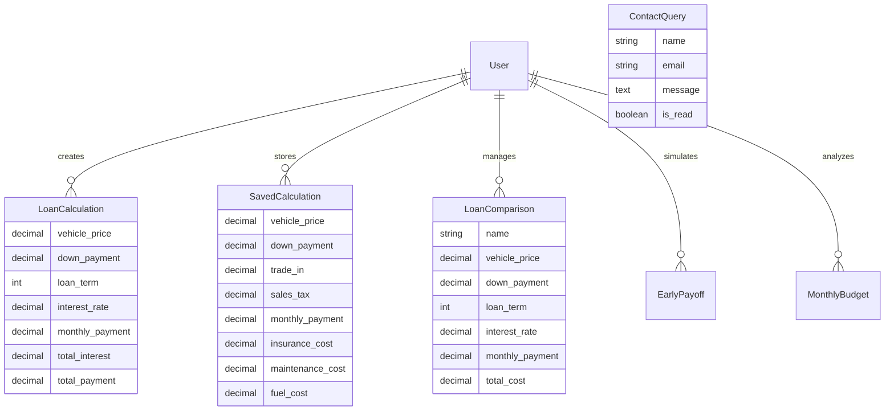

# 🚗 AI Car Loan Calculator & Valuation Platform

<div align="center">


**A full-featured, AI-powered car financing and vehicle appraisal web application built with Django and Google Gemini 2.0.**

[Explore Features](#-key-features) • [Installation](#-getting-started) • [Environment Config](#-environment-variables) • [Database Architecture](#-database-schema) • [API & Endpoints](#-routes--endpoints)

</div>

---

## 📖 Overview

**AI Car Loan Calculator** is an end-to-end financial platform engineered for car buyers. Beyond traditional monthly payment calculations, it offers **multimodal AI appraisal using Google Gemini 2.0 Flash** (supporting both image analysis and detailed spec inputs), credit-tier interest adjustments, total cost of ownership breakdowns, side-by-side loan scenario comparison, and high-fidelity PDF report generation.

---

## 🌟 Key Features

### 🧮 1. Smart Loan Calculator & Amortization
- **Customizable Terms**: Input vehicle price, down payment, loan tenure (12–96 months), and base interest rate.
- **Credit Score Impact Matrix**: Dynamic rate adjustments based on credit tiers (e.g., Tier 780+ discount vs. Subprime adjustments).
- **Total Cost of Ownership (TCO)**: Computes insurance, fuel, maintenance, warranty, and lifetime interest over the loan life.
- **Affordability Gauge**: Automatic budget verification against 15–30% monthly income rules.

### 🤖 2. Multimodal AI Vehicle Valuation (Gemini 2.0 Flash)
- **Image Appraisal**: Upload photos of the exterior/interior for instant visual vehicle condition assessment.
- **Manual Spec Appraisal**: Appraise by Make, Model, Year, Odometer reading (km), Condition rating, and Location.
- **Three-Tier Valuation Engine**:
  1. **Google Gemini 2.0 Flash**: Natural language inspection and dynamic market value estimation.
  2. **Rule-Based Depreciation Algorithm**: Fallback engine accounting for annual depreciation (12%/yr), city multipliers (e.g., Mumbai, Delhi, Bengaluru), and feature bonuses.
  3. **Structured Commentary**: Generates condition assessments, equipment impact analysis, and market trend forecasts.

### ⚖️ 3. Side-by-Side Loan Comparison
- Compare multiple loan offers (e.g., Bank A vs. Dealer Financing) side-by-side.
- Real-time comparison table tracking monthly payment variances, lifetime interest, and overall loan costs.

### 📑 4. Instant PDF Export
- Generates downloadable, print-ready PDF loan summaries and schedules powered by **WeasyPrint**.

### 🔐 5. Secure Authentication & Social Login
- Full user authentication lifecycle: Sign Up, Sign In, Password Change, and Sign Out.
- **Google OAuth2** integration via `social-auth-app-django` with custom backend support.
- User-isolated saved calculations and comparison portfolios.

---

## 🛠️ Technology Stack

| Domain | Technology | Description |
|---|---|---|
| **Backend Framework** | [Django 4.2](https://www.djangoproject.com/) | Robust MVC architecture with secure ORM |
| **Database** | [PostgreSQL](https://www.postgresql.org/) | Production relational database (SQLite dev fallback) |
| **AI / Machine Learning** | [Google Gemini 2.0 Flash API](https://ai.google.dev/) | Multimodal image and text vehicle valuation |
| **PDF Generation** | [WeasyPrint 60.2](https://weasyprint.org/) | HTML5/CSS3 to PDF renderer |
| **Social Auth** | `social-auth-app-django` | Google OAuth2 authentication pipeline |
| **Frontend** | Vanilla JS ES6+ & Bootstrap 5.3 | Responsive UI with modern glassmorphism design |
| **Icons & Typography** | Bootstrap Icons, FontAwesome, Google Fonts | *Plus Jakarta Sans* and *Inter* fonts |

---

## 📂 Project Structure

```
CarLoan/
├── loan_calculator/                  # Django project root
│   ├── manage.py                     # Django CLI
│   ├── requirements.txt              # Project dependencies
│   ├── .env.example                  # Environment template
│   ├── .env                          # Local secrets (git-ignored)
│   │
│   ├── loan_calculator/              # Project configuration
│   │   ├── settings.py               # Central settings & env loader
│   │   ├── urls.py                   # Master routing & auth views
│   │   ├── wsgi.py / asgi.py         # Deployment gateways
│   │
│   └── car_loan/                     # Core application
│       ├── models.py                 # 6 PostgreSQL models
│       ├── views.py                  # Core calculations & AI views
│       ├── urls.py                   # App routing endpoints
│       ├── forms.py                  # Form definitions & validation
│       ├── admin.py                  # Django Admin registrations
│       ├── backends.py               # Custom Google OAuth2 backend
│       │
│       ├── templates/
│       │   ├── car_loan/             # Main app templates (9 templates)
│       │   └── registration/         # Auth templates (4 templates)
│       │
│       └── static/car_loan/
│           ├── css/                  # Clean per-view modular stylesheets (8 files)
│           ├── js/                   # Dedicated modular JS scripts (9 files)
│           └── images/               # Logos and static assets
│
└── .gitignore                        # Standard Python/Django ignore rules
```

---

## 🚀 Getting Started

### 1. Prerequisites
- **Python 3.11+** installed
- **PostgreSQL** running locally on port `5432`
- **Git**

---

### 2. Clone and Setup Environment

```bash
# Clone the repository
git clone https://github.com/iamrajvardhanmall/Car-Loan-Calculator.git
cd Car-Loan-Calculator/CarLoan/loan_calculator

# Create and activate virtual environment
python -m venv .venv

# On Windows:
.venv\Scripts\activate

# On macOS/Linux:
source .venv/bin/activate

# Install required dependencies
pip install -r requirements.txt
```

---

### 3. Configure Environment Variables

Create a `.env` file inside `CarLoan/loan_calculator/` by copying the example:

```bash
cp .env.example .env
```

Configure your `.env` values:

```ini
SECRET_KEY=django-insecure-your-secret-key
DEBUG=True

# Database Credentials
DB_NAME=Car_Loan
DB_USER=postgres
DB_PASSWORD=your_postgres_password
DB_HOST=127.0.0.1
DB_PORT=5432

# Google Gemini API
GOOGLE_GEMINI_API_KEY=your_gemini_api_key_here

# Google OAuth2 Credentials (Optional for Social Login)
SOCIAL_AUTH_GOOGLE_OAUTH2_KEY=your_google_client_id
SOCIAL_AUTH_GOOGLE_OAUTH2_SECRET=your_google_client_secret
```

---

### 4. Database Setup & Migrations

Create the `Car_Loan` database in PostgreSQL, then apply all migrations:

```bash
# Apply migrations to PostgreSQL
python manage.py migrate

# Create superuser for Django Admin
python manage.py createsuperuser
```

---

### 5. Launch Development Server

```bash
python manage.py runserver
```

Open your browser and navigate to: **`http://127.0.0.1:8000`**

---

## 🔑 Environment Variables

| Variable | Description | Default / Example |
|---|---|---|
| `SECRET_KEY` | Django cryptographic signing key | *Auto-generated string* |
| `DEBUG` | Enables/disables debug mode | `True` |
| `DB_NAME` | PostgreSQL database name | `Car_Loan` |
| `DB_USER` | PostgreSQL user | `postgres` |
| `DB_PASSWORD` | PostgreSQL user password | `your_password` |
| `DB_HOST` | Database host address | `127.0.0.1` |
| `DB_PORT` | Database port | `5432` |
| `GOOGLE_GEMINI_API_KEY` | Google AI Studio API key | `AIzaSy...` |
| `SOCIAL_AUTH_GOOGLE_OAUTH2_KEY` | Google Cloud Console OAuth Client ID | `*.apps.googleusercontent.com` |
| `SOCIAL_AUTH_GOOGLE_OAUTH2_SECRET` | Google Cloud Console OAuth Secret | `GOCSPX-...` |

---

## 🗄️ Database Schema



---

## 🌐 Routes & Endpoints

| URL Path | View Function | Method | Auth Required | Description |
|---|---|---|:---:|---|
| `/` | `home_view` | `GET` | ❌ | Redirects to login |
| `/calculator/` | `calculator_view` | `GET` | ✅ | Interactive loan calculation dashboard |
| `/result/` | `result_view` | `GET` | ✅ | Detailed calculation report & charts |
| `/save-calculation/` | `save_calculation` | `POST` | ✅ | Saves current calculation to profile |
| `/saved/` | `SavedCalculationsView` | `GET` | ✅ | User's saved calculations archive |
| `/delete/<pk>/` | `delete_calculation` | `POST` | ✅ | Deletes a saved calculation |
| `/download_pdf/` | `download_pdf` | `GET` | ✅ | Generates downloadable PDF report |
| `/compare-loans/` | `compare_loans_view` | `GET`, `POST` | ✅ | Side-by-side loan scenario comparison |
| `/delete-comparison/<pk>/` | `delete_comparison` | `POST` | ✅ | Deletes a comparison record |
| `/value-estimator/` | `value_estimator` | `GET` | ✅ | AI Car Value Appraisal UI |
| `/value-estimator/api/` | `value_estimator_api` | `POST` | ✅ | Backend AI appraisal API endpoint |
| `/about/` | `about_view` | `GET`, `POST` | ❌ | About page and contact query submission |
| `/signup/` | `signup_view` | `GET`, `POST` | ❌ | User registration |
| `/login/` | `auth_views.LoginView` | `GET`, `POST` | ❌ | User authentication |
| `/logout/` | `auth_views.LogoutView` | `POST` | ❌ | User sign out |

---

## 🛡️ Security Best Practices

- **Strict Environment Isolation**: API keys and database credentials are fully decoupled from version control.
- **CSRF Protection**: Token validation on all mutable endpoints.
- **SQL Injection Prevention**: Built-in parameterized Django ORM queries.
- **Authentication Guards**: `@login_required` decorators and `LoginRequiredMixin` across financial calculation views.

---

## 👨‍💻 Author

**Rajvardhan Mall**
- **GitHub**: [@iamrajvardhanmall](https://github.com/iamrajvardhanmall)
- **LinkedIn**: [Rajvardhan Mall](https://www.linkedin.com/in/rajvardhan-mall-958bb8281/)
- **Email**: [rajvardhanmall@gmail.com](mailto:rajvardhanmall@gmail.com)

---

## 📄 License

This project is licensed under the **MIT License**. See the [LICENSE](LICENSE) file for more information.
