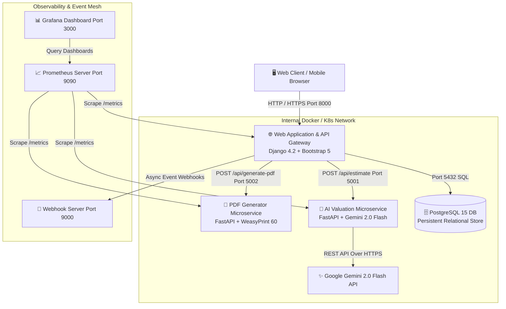
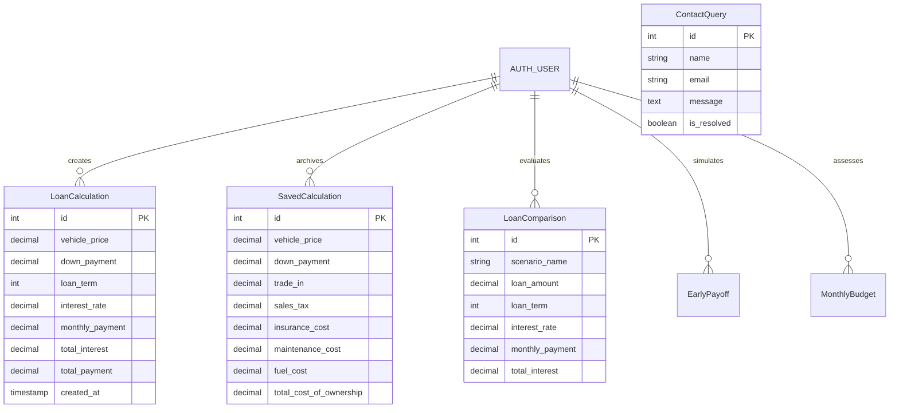

<div align="center">

# 🚗 AI Car Loan Calculator & Intelligent Valuation Platform

### *Enterprise-Grade Microservices Architecture for Precision Auto Financing, Multimodal AI Appraisal & Cloud-Native DevOps*

<p align="center">
  
  
  
  
  
  
  
  
  
  
</p>

[✨ Key Features](#-key-features) • [🏛️ Architecture](#-system-architecture) • [📦 Microservices](#-core-microservices) • [🐳 Docker Setup](#-quickstart-with-docker-compose) • [☸️ Kubernetes](#-kubernetes-orchestration) • [🏗️ Terraform AWS](#-infrastructure-as-code-terraform) • [📊 Observability](#-monitoring--observability) • [🗄️ Database Schema](#-database-architecture) • [🌐 API Endpoints](#-routes--api-reference)

---

</div>

## 📖 Overview

**AI Car Loan Calculator** is an end-to-end, production-ready financial technology and vehicle valuation platform. Engineered with a decoupled microservices architecture, the system combines **advanced loan mathematics** (amortization schedules, credit-tier interest adjustments, Total Cost of Ownership [TCO], early payoff simulations, and Debt-to-Income budget metrics) with **Multimodal AI Vehicle Valuation** powered by **Google Gemini 2.0 Flash**.

The platform is fortified with modern Cloud & DevOps engineering:
- **Containerized Ecosystem**: Fully orchestrated multi-service architecture via Docker Compose.
- **Kubernetes (K8s) Orchestration**: Production-grade deployments, service discovery, ConfigMaps, and Secrets.
- **Infrastructure as Code (IaC)**: Modular Terraform configurations provisioning automated AWS VPCs, Subnets, Security Groups, and EC2 instances.
- **Full-Stack Observability**: Native Prometheus instrumentation scraping real-time metrics, coupled with Grafana dashboards for throughput and latency analysis.
- **Event Webhooks & Stress Testing**: Asynchronous event dispatching system accompanied by high-concurrency load testing scripts.

---

## 🏛️ System Architecture


```mermaid
graph TD
    Client[🖥️ Web Client / Mobile Browser] -->|HTTP / HTTPS Port 8000| DjangoGateway[🌐 Web Application & API Gateway\nDjango 4.2 + Bootstrap 5]
    
    subgraph Core Services Mesh [Internal Docker / K8s Network]
        DjangoGateway -->|Port 5432 SQL| Postgres[(🗄️ PostgreSQL 15 DB\nPersistent Relational Store)]
        DjangoGateway -->|POST /api/estimate Port 5001| AIService[🤖 AI Valuation Microservice\nFastAPI + Gemini 2.0 Flash]
        DjangoGateway -->|POST /api/generate-pdf Port 5002| PDFService[📄 PDF Generator Microservice\nFastAPI + WeasyPrint 60]
        AIService -->|REST API Over HTTPS| GeminiAPI[✨ Google Gemini 2.0 Flash API]
    end

    subgraph Observability & Event Mesh
        Prometheus[📈 Prometheus Server Port 9090] -->|Scrape /metrics| DjangoGateway
        Prometheus -->|Scrape /metrics| AIService
        Prometheus -->|Scrape /metrics| PDFService
        Grafana[📊 Grafana Dashboard Port 3000] -->|Query Dashboards| Prometheus
        DjangoGateway -->|Async Event Webhooks| WebhookListener[🔔 Webhook Server Port 9000]
    end
```

---

## ✨ Key Features

### 🧮 1. Precision Auto Financing Engine
- **Configurable Calculations**: Customize vehicle price, down payment, loan term (12 to 96 months), and base interest rates.
- **Dynamic Credit Tier Adjustments**: Auto-applies APR rate changes based on credit tiers (Tier 780+ Super-Prime discount to Subprime tier adjustments).
- **Total Cost of Ownership (TCO)**: Complete lifecycle cost modeling incorporating insurance, periodic maintenance, fuel expenses, dealer documentation fees, sales tax, and warranty packages.
- **Early Payoff & Extra Payment Simulator**: Models monthly, quarterly, yearly, or lump-sum prepayments with real-time interest and term-reduction metrics.
- **Debt-to-Income (DTI) Budget Gauge**: Real-time financial health diagnostic (Healthy, Moderate, High Risk) against net monthly income thresholds.

### 🤖 2. Multimodal AI Vehicle Appraisal (Google Gemini 2.0 Flash)
- **Computer Vision Image Appraisal**: Upload vehicle exterior/interior photos for automated visual damage and condition assessment.
- **Algorithmic Spec Appraisal**: Appraise vehicles based on Make, Model, Manufacturing Year, Mileage/Odometer, Mechanical Condition, and City location.
- **High-Resilience Dual-Engine Architecture**:
  1. **Primary**: Google Gemini 2.0 Flash for structured natural language analysis, feature valuation, and market forecasting.
  2. **Secondary (Fallback)**: Algorithmic depreciation engine calculating compounded 12%/year depreciation, localized city economic indices (e.g., Mumbai, Delhi, Bengaluru), and premium trim bonuses.

### ⚖️ 3. Multi-Scenario Loan Comparison
- Side-by-side comparison matrix for evaluating dealer financing vs. commercial bank loans.
- Compares monthly payment deltas, lifetime interest costs, and net savings.

### 📑 4. High-Fidelity PDF Export
- Dynamic A4 PDF generation powered by **WeasyPrint** and Jinja2 templates.
- Exports branded loan breakdowns, payment schedules, and AI appraisal reports.

### 🔐 5. Enterprise Security & Authentication
- Session-based authentication with role-based profile isolation.
- **Google OAuth2 Social Authentication** via `social-auth-app-django`.
- Protected against OWASP vulnerabilities: CSRF protection, SQL injection prevention via parameterized ORM queries, and strict XSS sanitization.

---

## 📦 Core Microservices

| Service | Technology | Port | Primary Responsibilities |
|---|---|:---:|---|
| **🌐 Web Gateway** | Django 4.2 / Python 3.11 | `8000` | UI presentation, user auth, credit scoring, persistence, and service routing |
| **🤖 AI Valuation** | FastAPI / Pydantic / Uvicorn | `5001` | Multimodal visual inspection & Gemini 2.0 Flash appraisal |
| **📄 PDF Generator** | FastAPI / WeasyPrint 60.2 | `5002` | Print-ready A4 PDF rendering of amortization & quotes |
| **🗄️ Database** | PostgreSQL 15 Alpine | `5432` | Relational storage for user accounts, calculations, and loan models |
| **🔔 Webhooks** | Python HTTP Event Worker | `9000` | Asynchronous event listener and webhook dispatcher |
| **📈 Prometheus** | Prometheus v2.45+ | `9090` | Timeseries metric collector scraping service `/metrics` endpoints |
| **📊 Grafana** | Grafana Labs v10+ | `3000` | Visual operational dashboards and SLA monitoring |

---

## 📂 Project Structure

```
CarLoan/
├── docker-compose.yml                  # Unified microservices orchestration
├── .env.example                        # Template for environment configuration
├── load_test.py                        # Concurrency and load testing suite
├── webhook_server.py                   # Event notification test listener
│
├── services/                           # Autonomous Microservices
│   ├── ai_valuation_service/           # 🤖 AI Appraisal Microservice (FastAPI - Port 5001)
│   │   ├── Dockerfile
│   │   ├── main.py                     # Gemini 2.0 Flash integration & fallback engine
│   │   ├── requirements.txt
│   │   └── README.md
│   │
│   └── pdf_service/                    # 📄 PDF Generation Microservice (FastAPI - Port 5002)
│       ├── Dockerfile
│       ├── main.py                     # WeasyPrint document generator
│       ├── requirements.txt
│       └── README.md
│
├── loan_calculator/                    # 🌐 Main Web Application (Django 4.2 - Port 8000)
│   ├── Dockerfile
│   ├── manage.py
│   ├── requirements.txt
│   ├── loan_calculator/                # Global settings, URLs, & WSGI
│   └── car_loan/                       # Core application domain
│       ├── models.py                   # Relational ORM models
│       ├── views.py                    # Gateway controllers & business logic
│       ├── urls.py                     # Web endpoints
│       ├── templates/                  # Bootstrap 5 UI templates
│       └── static/                     # Custom CSS, JS, and asset pipeline
│
├── k8s/                                # ☸️ Kubernetes Manifests
│   ├── postgres.yaml                   # PostgreSQL Deployment, Service & PV/PVC
│   ├── web-app.yaml                    # Django Web Deployment, Service & Ingress
│   ├── ai-valuation.yaml               # AI Service Deployment & ClusterIP Service
│   └── pdf-service.yaml                # PDF Service Deployment & ClusterIP Service
│
├── terraform/                          # 🏗️ AWS Infrastructure as Code (IaC)
│   ├── main.tf                         # VPC, Subnets, Gateways, EC2, & Security Groups
│   ├── variables.tf                    # AWS regions, instance types, and CIDRs
│   └── outputs.tf                      # Public IPs and DNS endpoints
│
└── monitoring/                         # 📊 Observability Stack
    ├── prometheus.yml                  # Scraping configurations for all services
    └── docker-compose.monitoring.yml   # Dedicated Prometheus & Grafana stack
```

---

## 🐳 Quickstart with Docker Compose

The fastest way to spin up the entire microservices ecosystem is with Docker Compose:

### 1. Clone the Repository & Configure Environment
```bash
git clone https://github.com/iamrajvardhanmall/Car-Loan-Calculator.git
cd Car-Loan-Calculator/CarLoan
cp .env.example .env
```

> **Note**: Update `.env` with your `GOOGLE_GEMINI_API_KEY` to enable AI vehicle appraisals.

### 2. Launch All Services
```bash
docker compose up -d --build
```

### 3. Run Database Migrations
```bash
docker compose exec web_app python manage.py migrate
docker compose exec web_app python manage.py createsuperuser
```

### 4. Access the Services
- **Web Platform**: [http://localhost:8000](http://localhost:8000)
- **AI Valuation API Docs**: [http://localhost:5001/docs](http://localhost:5001/docs)
- **PDF Service API Docs**: [http://localhost:5002/docs](http://localhost:5002/docs)

---

## ☸️ Kubernetes Orchestration

Deploy the entire microservice ecosystem onto a local or cloud Kubernetes cluster (Minikube, Kind, or AWS EKS):

```bash
# 1. Apply Secrets & ConfigMaps
kubectl apply -f k8s/postgres.yaml

# 2. Deploy AI & PDF Microservices
kubectl apply -f k8s/ai-valuation.yaml
kubectl apply -f k8s/pdf-service.yaml

# 3. Deploy Main Web Gateway & Run Migrations
kubectl apply -f k8s/web-app.yaml

# 4. Verify Pod Health
kubectl get pods -w
```

---

## 🏗️ Infrastructure as Code (Terraform)

Provision the complete AWS cloud networking and compute layer using Terraform:

```bash
cd terraform/

# Initialize Terraform providers
terraform init

# Validate configuration
terraform plan

# Deploy infrastructure to AWS
terraform apply -auto-approve
```

---

## 📊 Monitoring & Observability

The platform includes built-in Prometheus and Grafana instrumentation for real-time observability:

```bash
# Launch Prometheus and Grafana stack
docker compose -f monitoring/docker-compose.monitoring.yml up -d
```

- **Prometheus Dashboard**: [http://localhost:9090](http://localhost:9090)
- **Grafana Dashboard**: [http://localhost:3000](http://localhost:3000) *(Default credentials: `admin` / `admin`)*

---

## 🗄️ Database Architecture


```mermaid
erDiagram
    AUTH_USER ||--o{ LoanCalculation : creates
    AUTH_USER ||--o{ SavedCalculation : archives
    AUTH_USER ||--o{ LoanComparison : evaluates
    AUTH_USER ||--o{ EarlyPayoff : simulates
    AUTH_USER ||--o{ MonthlyBudget : assesses

    LoanCalculation {
        int id PK
        decimal vehicle_price
        decimal down_payment
        int loan_term
        decimal interest_rate
        decimal monthly_payment
        decimal total_interest
        decimal total_payment
        timestamp created_at
    }

    SavedCalculation {
        int id PK
        decimal vehicle_price
        decimal down_payment
        decimal trade_in
        decimal sales_tax
        decimal insurance_cost
        decimal maintenance_cost
        decimal fuel_cost
        decimal total_cost_of_ownership
    }

    LoanComparison {
        int id PK
        string scenario_name
        decimal loan_amount
        int loan_term
        decimal interest_rate
        decimal monthly_payment
        decimal total_interest
    }

    ContactQuery {
        int id PK
        string name
        string email
        text message
        boolean is_resolved
    }
```

---

## 🌐 Routes & API Reference

### 🖥️ Web Application Routes

| Path | View | Method | Auth | Description |
|---|---|:---:|:---:|---|
| `/` | `home_view` | `GET` | ❌ | Landing page & gateway redirect |
| `/calculator/` | `calculator_view` | `GET` | ✅ | Interactive loan financing calculator |
| `/result/` | `result_view` | `GET` | ✅ | Calculation breakdown & charts |
| `/save-calculation/` | `save_calculation` | `POST` | ✅ | Saves current TCO calculation |
| `/saved/` | `SavedCalculationsView` | `GET` | ✅ | Archived user calculation portfolio |
| `/compare-loans/` | `compare_loans_view` | `GET`, `POST` | ✅ | Side-by-side loan scenario comparison |
| `/value-estimator/` | `value_estimator` | `GET` | ✅ | AI Car Value Appraisal UI |
| `/download_pdf/` | `download_pdf` | `GET` | ✅ | Generates downloadable PDF report |
| `/about/` | `about_view` | `GET`, `POST` | ❌ | Platform overview & contact form |
| `/signup/` | `signup_view` | `GET`, `POST` | ❌ | User registration |
| `/login/` | `auth_views.LoginView` | `GET`, `POST` | ❌ | User authentication |

### 🤖 Microservice API Endpoints

| Service | Method | Endpoint | Description |
|---|:---:|---|---|
| **AI Valuation** | `POST` | `/api/estimate` | Performs multimodal or spec vehicle valuation via Gemini 2.0 |
| **AI Valuation** | `GET` | `/health` | Healthcheck probe for container orchestration |
| **AI Valuation** | `GET` | `/metrics` | Prometheus metrics scrape endpoint |
| **PDF Service** | `POST` | `/api/generate-pdf` | Renders styled HTML/CSS data into a high-res A4 PDF |
| **PDF Service** | `GET` | `/health` | Healthcheck probe for container orchestration |
| **PDF Service** | `GET` | `/metrics` | Prometheus metrics scrape endpoint |

---

## 🧪 Stress & Load Testing

Execute the built-in asynchronous load testing suite to benchmark backend throughput under high concurrency:

```bash
# Run benchmark against calculation & valuation endpoints
python load_test.py --concurrency 50 --requests 500
```

---

## 👨‍💻 Author

**Rajvardhan Mall**
- **GitHub**: [@iamrajvardhanmall](https://github.com/iamrajvardhanmall)
- **LinkedIn**: [Rajvardhan Mall](https://www.linkedin.com/in/rajvardhan-mall-958bb8281/)
- **Email**: [rajvardhanmall@gmail.com](mailto:rajvardhanmall@gmail.com)

---

## 📄 License

This project is licensed under the **MIT License** - see the [LICENSE](LICENSE) file for details.
